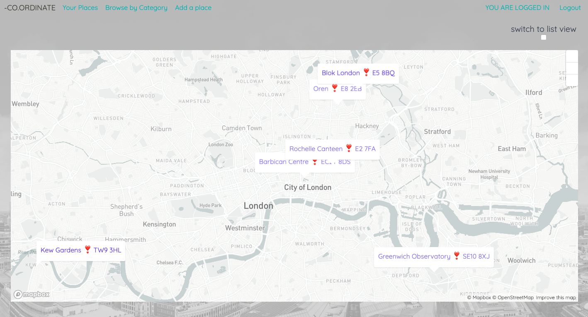
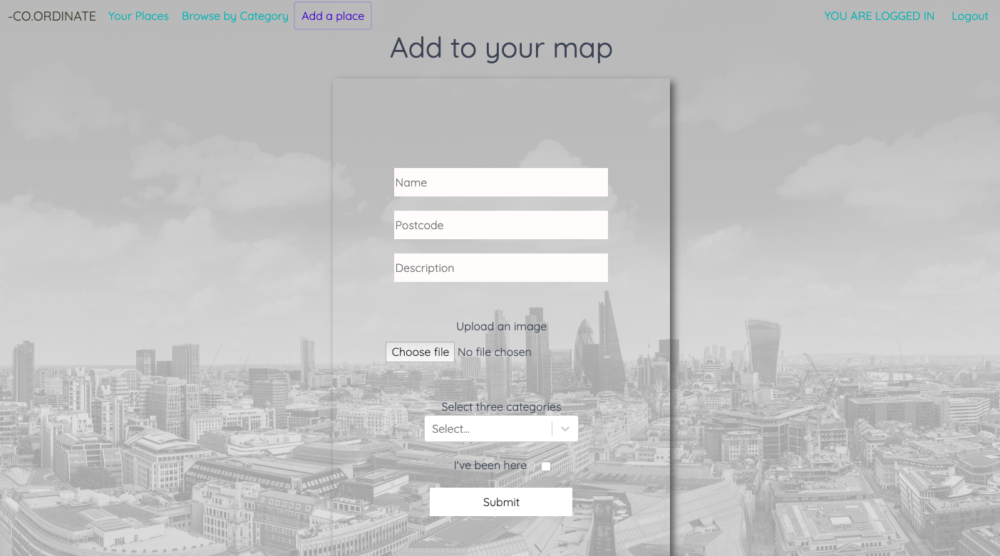
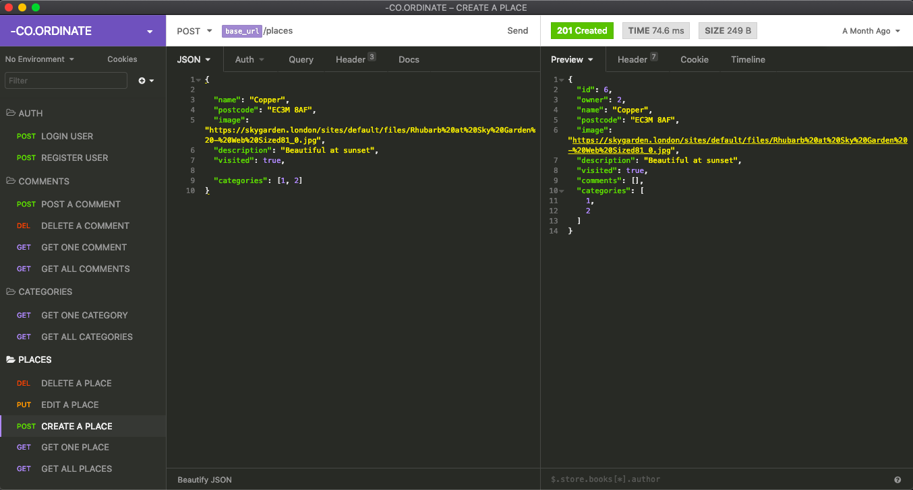
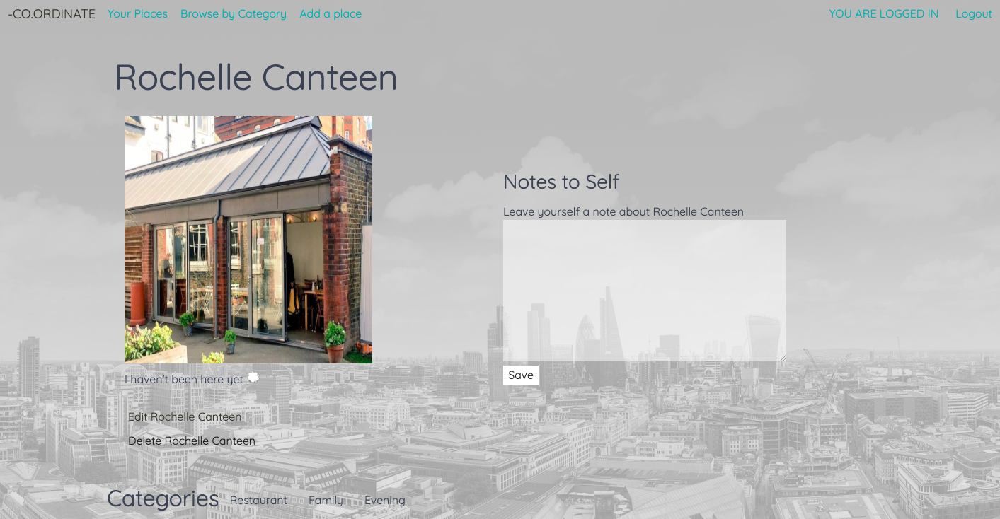
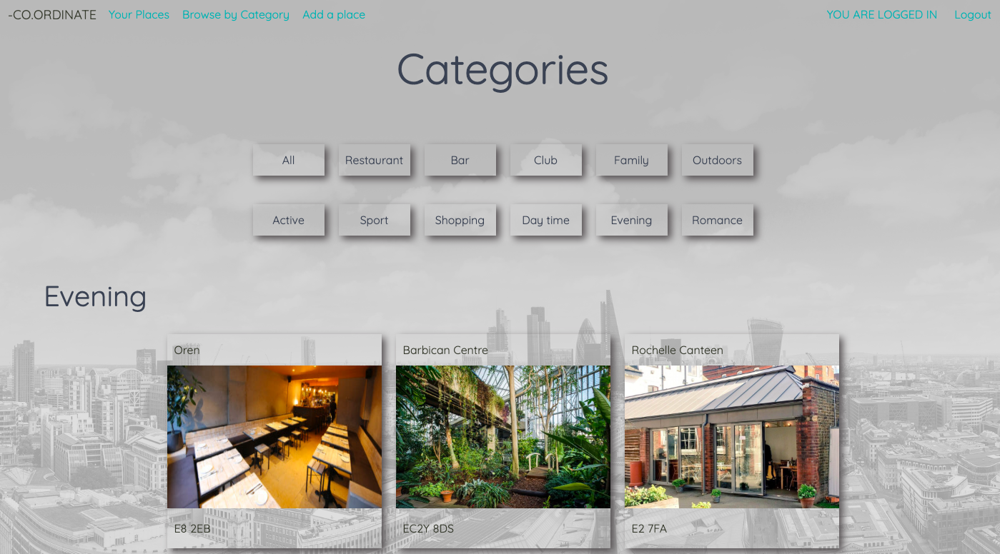

# Software Engineering Immersive – Project 04

This was the fourth and final project on the General Assembly Software Engineering Immersive. It was a solo project which took place over 7 days.

# -CO.ORDINATE

-Co.ordinate is a website that allows the user to login and create a 'to-go' list of places they would like to visit or have visited. They can also add images and notes to their places. 

## Brief

    - Build a full-stack application with backend and front-end using Django with PostgresQL and ReactJS.

    - Work with at least 3 models, incorporating nested or populated serializers / one-to-one and manay-to many models

    - Incorporate CRUD funtionality 

    - Consume one or more public APIs

    - Establish a user journey and wireframes that clearly show which elements are MVP (CRUD fucntionality) and which elements are bonus features

    - Deploy the project online 


## Deployment 

The project is deployed online with Heroku and can be found here:

https://allotaveg.herokuapp.com/

## Getting started

Use the clone button to download the source code. Enter the following commands in the CLI: 

```
<!— To install all the packages listed in the package.json: —> $ yarn 

<!- Navigate into the shell -> $ pipenv shell

<!— Run the app on localhost:4000 : —> $ yarn serve:back 

<!— Check the console for any issues and if there are any then check the package.json for any dependancies missing —>

<!- Navigate to http://localhost:4000/>
```

## Technologies Used:

    JavaScript
    React
    HTML5
    CSS3
    Sass
    Python
    Django
    PostgresQL
    Axios
    Yarn
    Insomnia


### External APIs

    MapBox API
    Postcodes.io API
    Cloudinary API

## User Experience 

The website is a place where users can add places they would like to go to or have visited to their 'to-go' list. The idea is that the site can give users a more visual representation than a traditional to-do list. So it can be used as a reminder of the geographical locations of their favourite places. 



With full CRUD functionality, the user also has the ability to update and delete their places or the notes that they have made about their place.

The user has to be logged in to be able to add a place to their list. 



The below is a code snippet from the create place component. It features a multi-select component from React-Select for categories chosen and an Image Upload component using the Cloudinary API. This means that the user can upload an image from their device rather than pasting in a URL. 

The image is posted to Cloudinary where it is assigned a secure URL, the URL is then fetched from Cloudinary and assigned to the image property using setState. It can then be added to the new place that has been created.

```
handleUpload({ target: { files } }) {
    this.setState({ loading: true }, () => { // do this fucntion while loading is true
      const body = new FormData
      body.append('file', files[0])
      body.append('upload_preset', 'qpedrr5c')
      fetch('https://api.cloudinary.com/v1_1/dpmupgnig/image/upload', { method: 'POST', body, contentType: 'application/json' })
        .then(res => res.json())  
        .then(res => {
          console.log(this.props, 'props')
          this.setState(
            { image: res.secure_url, loading: false },
            this.props.onChange({ target: { name: this.props.name, value: res.secure_url } })
          )
        })
    })
  }
  ```

The Multi-Select allows the user to select and add mulitple categories to the place they are adding or editing. The handleMultiSelect function allows the user to set the category ID into state which is what is required by the Place model as shown below

  ```

  handleMultiSelect(selected) {
    if (!selected) {
      return this.setState({ data: { ...this.state.data, categories: [] } })
    }
    const data = { ...this.state.data, categories: selected.map(sel => sel.id) }
    console.log(data)
    this.setState({ data })
  }
  ```
```
class Place(models.Model):
    name = models.CharField(max_length=50, unique=True)
    postcode = models.CharField(max_length=10)
    image = models.CharField(max_length=500, blank=True)
    description = models.CharField(max_length=100, blank=True)
    visited = models.BooleanField(default=False)
    categories = models.ManyToManyField(
        Category,
        related_name='places',
        blank=True # M2M field is a string so this needs to be blank
    )
    owner = models.ForeignKey(
        User,
        related_name='places',
        on_delete=models.CASCADE,
        null=True,
        blank=True
    ) 
  ```

  ### Create testing in Insomnia 

 
   

As the owner, the user now has the ability to add notes to their place, update it or delete it. They can create and delete notes. 

 


The user can also view places by Category as it thought it would be a useful feature to have a categories index page. By clicking on a category at the top of the page, the user can filter the results to only show places from that category.

 


## Reflection and Future improvements 

Overall, I was pleased with the outcome of my project. My aim was to push myself to see what I could achieve in a week and I think that I managed to accomplish a good amount of what I set out to do. 

I have learnt however that I should be more realistic in terms of the goals I set myself within the given time frame. 

I would have liked to implement testing for both the Django backend and the React frontend, to build on what I had done in terms of back end development testing in Insomnia. 

I would have liked to add a friends and 'place sharing' functionality with the possibility for multiple users to view each other's places and to give and receive recommendations. An extra feature to this would be to have a chat feature using a chat package for React.    